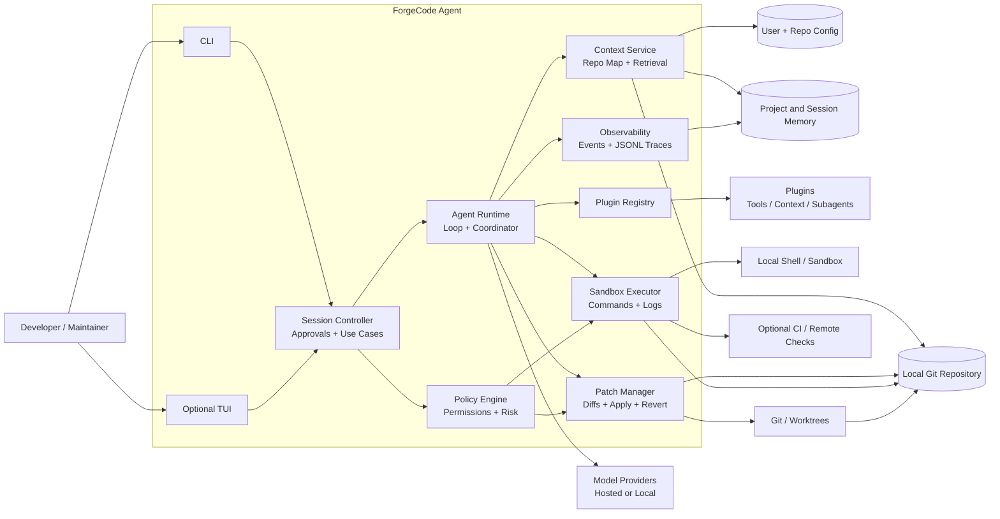
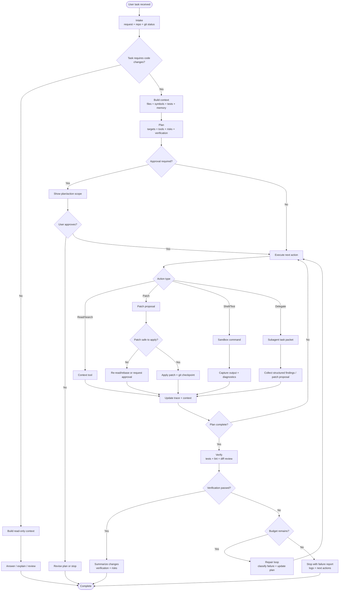
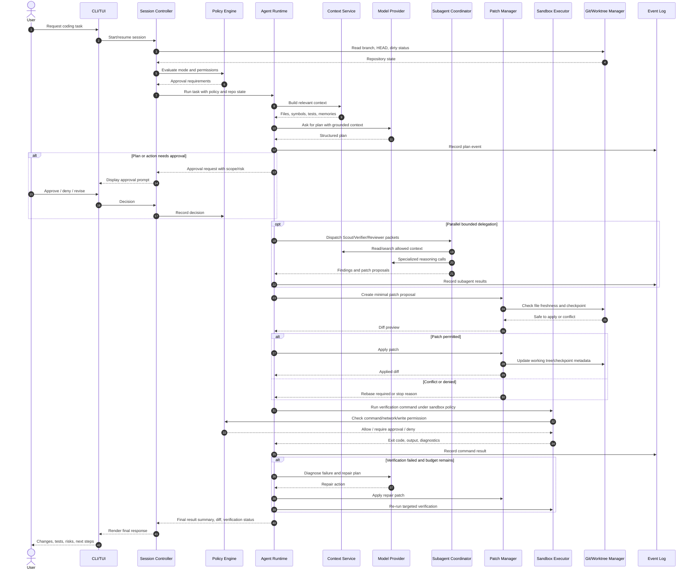

# ForgeCode Agent — Executive Design Review

> Generated after three independent subagents completed architecture, product/scope, and QA/test-suite design. No application code was written before these design artifacts.

**Project folder:** `/Users/ericlara/Documents/OpenSourceCodingAgentLab`  
**Working tool name:** ForgeCode Agent  
**Premise:** Build an original open-source coding agent in the same category as Claude Code/Codex: a CLI/TUI coding teammate that plans, edits, tests, reviews, and commits with human approval gates.

## 1. Design Summary

ForgeCode Agent is designed as a local-first, provider-neutral coding agent with a deterministic controller loop, typed domain boundaries, auditable tool execution, git/worktree isolation, subagent orchestration, and a strict QA-first engineering process.

## 2. Core Architecture Domains

- **Interface layer:** CLI first; optional TUI later. Commands are thin adapters, not business logic.
- **Application layer:** use cases such as `plan`, `run`, `review`, `apply`, `doctor`, and `resume`.
- **Domain layer:** task model, agent loop state machine, tool call intents, review gates, run ledger, policies.
- **Infrastructure layer:** model providers, file/git/shell tools, sandbox adapters, config loader, logs, persistence.
- **QA layer:** fake model provider, fake tools, golden transcripts, security fixtures, deterministic loop tests.

## 3. Clean-Code Patterns Selected

- Hexagonal/ports-and-adapters architecture.
- Command pattern for tool calls.
- State machine for the agent loop.
- Strategy pattern for model providers and context policies.
- Repository pattern for run/session persistence.
- Policy objects for security/approval decisions.
- Immutable/event-sourced run ledger for auditability.

## 4. MVP Scope

- `forgecode init`, `plan`, `run`, `review`, `apply`, `doctor`, `resume`.
- Provider abstraction with at least a fake provider first, then one real provider adapter.
- Read/search/patch/file tools, shell execution behind allow/deny policy, git diff/status/worktree support.
- Human approval gates for writes, shell commands, commits, network access, and external delivery.
- Subagent-style role loop documented in `agents/`, with reviewer roles never approving their own work.

## 5. QA Strategy

- TDD is mandatory: no production behavior without a failing test first.
- Golden transcript tests validate deterministic agent loops.
- Fake model provider and fake tools are first-class test infrastructure.
- Security tests include prompt injection, shell injection, path traversal, secrets exposure, and unsafe git operations.
- CI gates: unit, integration, security abuse tests, golden replay, lint/typecheck.

## 6. Diagrams

### Domain / Context Diagram

### Agent Loop Flow Diagram

### Sequence Diagram

## 7. Human Review Gates

- Approve product direction before broad feature expansion.
- Approve any real provider integration secrets/config.
- Approve any operation that pushes, publishes, installs global packages, or contacts external services.
- Approve license choice before public release. Recommended default: Apache-2.0 or MIT, with Apache-2.0 preferred if patent language matters.

## 8. Immediate Implementation Plan

1. Establish project metadata and package skeleton.
2. Write fake-provider and domain-state tests first.
3. Implement minimal domain models to satisfy tests.
4. Add tool interfaces and fake tool registry.
5. Implement deterministic controller loop with approval states.
6. Add CLI wrapper only after the domain loop is tested.
7. Run independent spec and quality review after each slice.

## 9. Source Design Documents

- Architecture research: `docs/architecture/architecture-research.md`
- Product scope: `docs/product/feature-scope.md`
- QA strategy: `docs/qa/qa-test-strategy.md`
- Initial test suite design: `docs/qa/initial-test-suite-design.md`
- Diagrams: `docs/diagrams/*.mmd`
